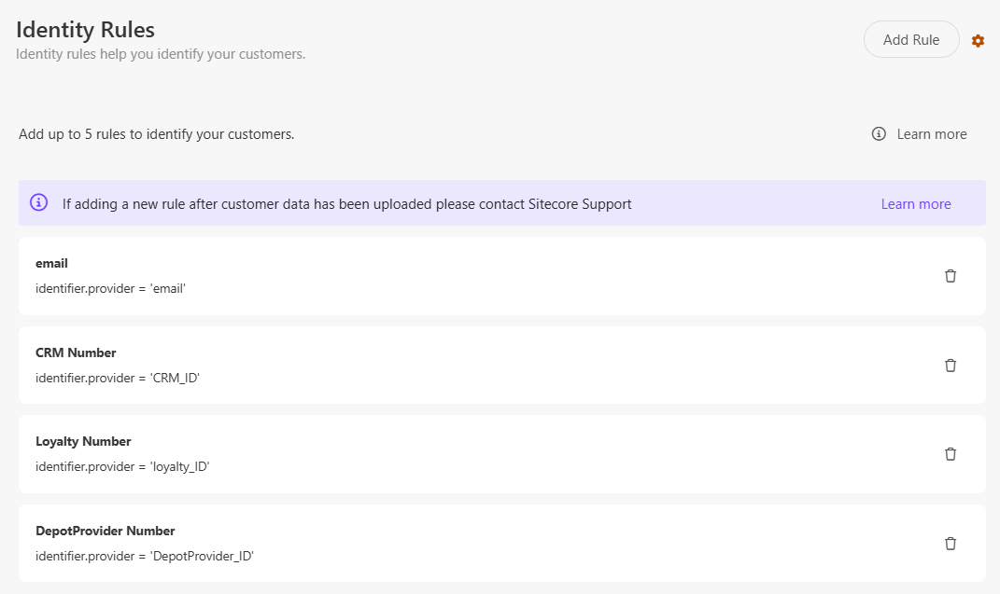

## CDP Engagement Generator
Kickstart your CDP Learning Journey by running a locally hosted app that generates all kinds of user activity and pushes it up to your CDP instance!

This is a [Next.js](https://nextjs.org) project bootstrapped with [`create-next-app`](https://nextjs.org/docs/app/api-reference/cli/create-next-app) and [Sitecore Engage SDK package](https://doc.sitecore.com/cdp/en/developers/api/integrate-engage-sdk-nextjs-server-side.html) (server-set cookies).

🐻 Engage SDK managed using [Zustand State Management](https://github.com/pmndrs/zustand) <br>
Ⓜ️ Thoughtfully crafted using Tailwind &amp; Mantine

✨ Current Feature List
- Current User Tracking via Engage SDK
    - VIEW event configured at Layout with Zustand Provider
    - IDENTITY event via Simple Form (FormCoupon)
- Simulating Events via Stream API Direct HTTPS Requests
    - Simulating 10 new guests with page view
- Add to cart for ADD event configured

## Getting Started

### Create a Local .env at the root with the required Engage attributes
```.env
NEXT_PUBLIC_ENGAGE_CLIENT_KEY=your_value
NEXT_PUBLIC_ENGAGE_TARGET_URL=your_value                # ex: https://api-engage-eu.sitecorecloud.io
NEXT_PUBLIC_ENGAGE_POS=your_value
NEXT_PUBLIC_ENGAGE_IDENTITY=your_value                  # ex: DepotProvider_ID
```

### Setup Identity Rule in CDP
The code base is configured to send IDENTITY events through the ENV variable `NEXT_PUBLIC_ENGAGE_IDENTITY`. This Identity Provider will need to be added as a rule in your CDP if you want IDENTITY events to convert Visitors to Customers.



### Run the development server

```bash
npm run dev
# or
yarn dev
# or
pnpm dev
# or
bun dev
```

Open [http://localhost:3000](http://localhost:3000) with your browser to start sending data to your CDP!

